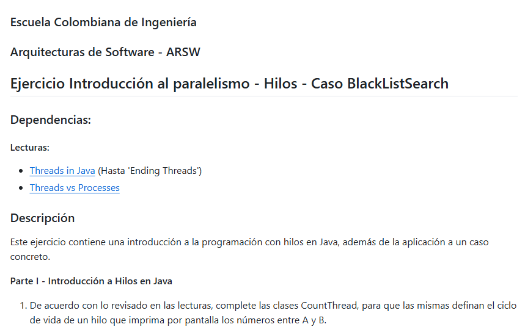
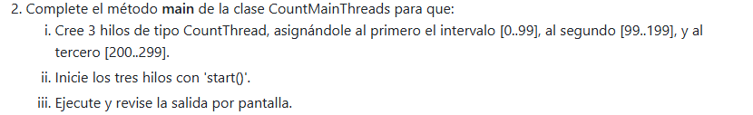
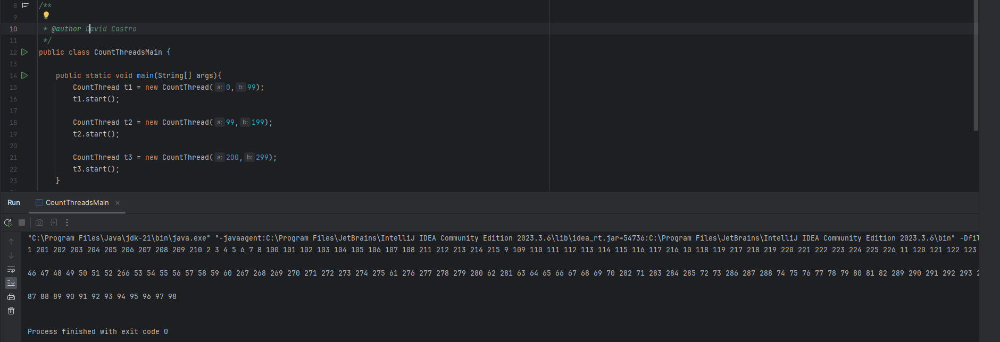
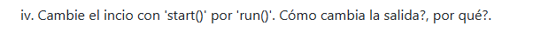
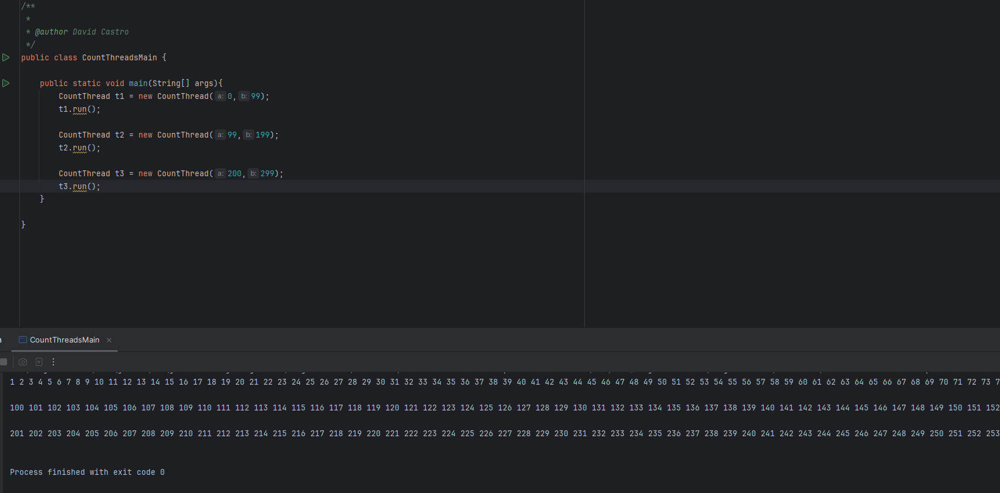
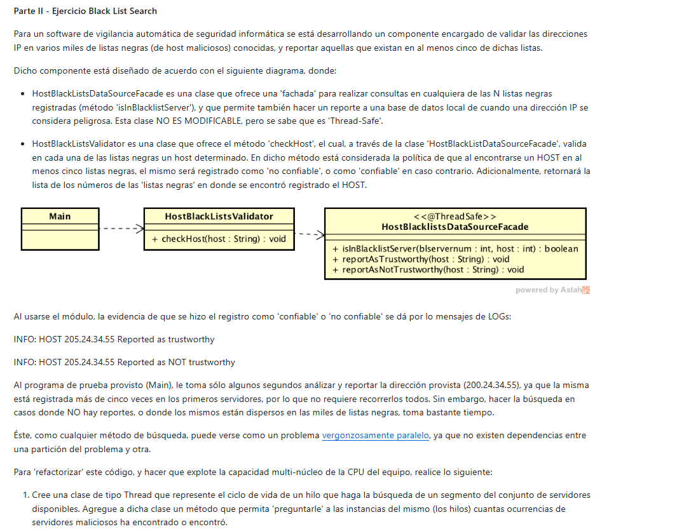

# lab1-arsw

## Nombre: David Santiago Castro

Para este punto desarrollamos el siguiente codigo en CountThread:

Y lo probamos en CountThreadMain:

Vemos que el orden de ejecucion de los hilos no esta garantizado por lo que los numeros se imprimen en cualquier orden

Lo que esta sucediendo es que se esta ejecuntando de forma secuecial como si no hubieran hilos lo cual hace que no se ejecuten en paralelo

