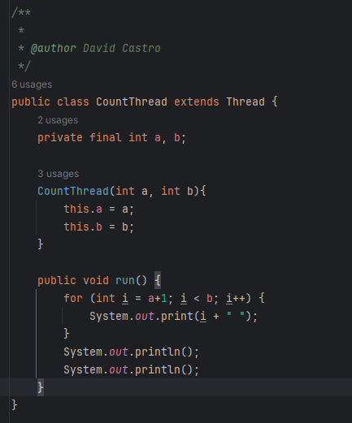
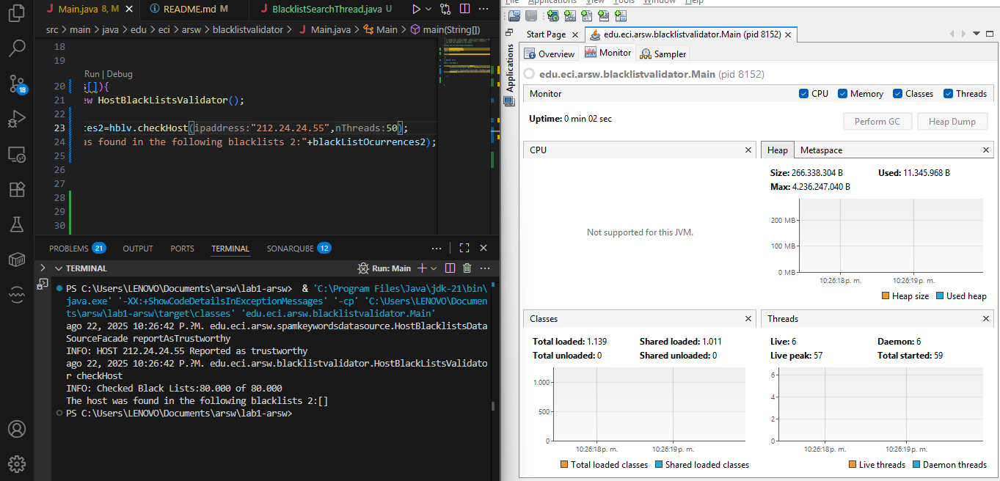

# lab1-arsw

## Nombre: David Santiago Castro

Para este punto desarrollamos el siguiente codigo en CountThread:

Y lo probamos en CountThreadMain:

Vemos que el orden de ejecucion de los hilos no esta garantizado por lo que los numeros se imprimen en cualquier orden

Lo que esta sucediendo es que se esta ejecuntando de forma secuecial como si no hubieran hilos lo cual hace que no se ejecuten en paralelo

Se creo la clase BlacklistSearchThread en donde validaremos representamos el ciclo de vida de un hilo que haga la búsqueda de un segmento del conjunto de servidores disponibles y en addicional el conteo y el numero de listas donde se busco

Para este punto se refactorizo el metodo que se tenia de checkHost para que enviara como parametro al nuevo metodo checkHost que tendra un parametro N que divide en partes iguales de segmentos y los distribuye a cada hilo para que cada hilo paralelamente busque en esos servidores si el host es malicioso y al final se suman, resultado de la operacion, entre mas grande sea N, mas rapido es buscar en todos los servidores tomando segundos en comparacion a que si fuera solo un hilo, resultado de salida de blackListOcurrences2 con la ip 200.24.34.55 solo toma segundos

El problema lo podriamos mirar de varias maneras, desde la menos optima que seria que por cada hilo si hay 5 ocurrencias se detenga en todos los hilos, tener un elemento de coordinacion y visualizacion de memoria entre hilos, haciendo un uso de estado compartido o usuando ExecutorService y invokeAll para realizar la cancelación

1) Un solo hilo:

2) Tantos hilos como núcleos de procesamiento (haga que el programa determine esto haciendo uso del API Runtime).

3) Tantos hilos como el doble de núcleos de procesamiento.

4) 50 hilos.

5) 100 hilos.

Con lo anterior, y con los tiempos de ejecución dados, haga una gráfica de tiempo de solución vs. número de hilos. Analice y plantee hipótesis con su compañero para las siguientes preguntas (puede tener en cuenta lo reportado por jVisualVM):

Podemos observar que es una gfuncion logarítmica

Teniendo en cuenta que con un hilo tomo 135 segundos, podemos obteber a P como aproximadamente 0.9926 en donde con 200 hilos segun la funcion daria 1.67 segundos y con 500 1.27 y aunque hay mejora es minima ya que esta ley tiene un limite que seria lo optimo dicho limite

Trabajar con tanto hilos como nucleos es conocido como punto dulce aunque normalmente no porque se duplique los hilos se reduce el tiempo a la mitad, a veces puede empeorar, o puede mejorar ligeramente

100 hilos en una CPU puede ocasionar conmutacion y presion de memoria como mejoras limitadas hasta un limite

1 hilo en 100 maquinas significamenos posibilidad de datos locales, si se introduce latencia de red, si el overhead es pequeño frente al computo mejora, pero si es grande va a haber estancamiento.